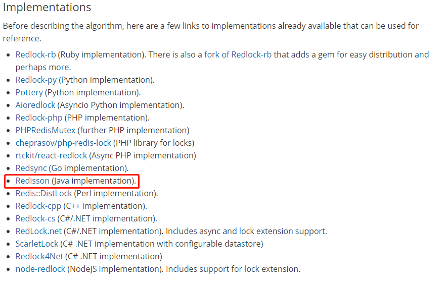

# project description (项目描述)

> project name : distributed-com.coder.distribute.lock

> author : LGZ

> description: java 实现 redis 分布式锁.

## module introduce (模块介绍)
前置说明：运行服务之前需要先启动 redis ，请求服务之前需先使用 redis 命令 `set Mi11 100` 初始化商品库存
| module name | description | explain |
| :---: | :--- | :---: |
|  redis001 | 实现基本业务，请求一次接口扣减一个库存，实现抢购逻辑。用 ReentrantLock 加锁。| 单台服务 |
|  redis002 | 和 redis001 完全相同的代码  | 多台服务  nginx 反代负载均衡  jmeter 测试高并发情况 [nginx和jemeter配置](./NGINX&JEMETER.md) |
|  redis003 | 基本业务和其上面的 module 一样，不同的是加了redis 分布式锁,事务 | [redis 事务简介](./Redis-Transactions.md) |
|  redis004 | 和 redis003 完全相同，一起启动， | 多台服务  nginx 反代负载均衡  jmeter 测试高并发情况 nginx配置同上 |
|  redis005 | 使用 [redis官方推荐的](https://redis.io/topics/distlock) [redisson](https://github.com/redisson/redisson)    | …… |
|  redis006 | 和 redis005 完全相同，一起启动， | …… |

## development environment (开发环境)
- SYSTEM:  windows 10
- LANGUAGE:  JAVA 1.8
- IDE:  IntelliJ IDEA
- redis: 单台
- nginx-1.19.6
- apache-jmeter-5.4
- spring-boot-2.3.4.RELEASE
- maven
